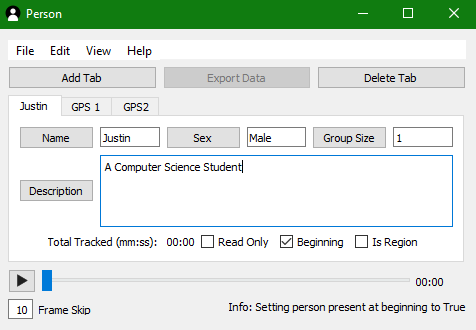

## Justin Petluk

## About me 

My name is Justin Petluk and I received my Bsc in Computer Science at University of Lethbridge in 2020.

During my degree, I explored GIS courses and was invited to work with [Barrett-Henzi Lab](https://banzilab.github.io/people.html)

I started out with an [Independent Study](https://github.com/hobbitsyfeet/UofLStudy), to explore how an aerial video could be used to extract real-time gps locations of animals on the ground. We took to the coulies and recorded a video with a Gopro and used a handled GPS to mark the spraypainted coordinates, and I went to learn about image processing and [OpenCV](https://opencv.org/).

After that course concluded, I was asked if, given a depth camera, could I measure the length of a Vervet Forearm? I said "sure!"

So then I went on a journey to learn about Pointclouds, and after my Advanced Data Processing and Recomendation Systems, I started to learn more about how data is used. I took with an interest on how to analyze Pointclouds with [Point Cloud Library](https://pointclouds.org/), and [Open3D](http://www.open3d.org/) as shown in [3DMeasure](https://github.com/hobbitsyfeet/3DMeasure). Additionally, I decided that this could be done automatically, so I did an Independent Study on Pointnet++ and PointCNN, as well as clustering methods to learn how this data worked in the case of animals. I was generously lent taxidermy animals for testing.

I then took multiple Remote Sensing courses to learn how this type of data was handled and how to transform data into valuable information.

I continue to explore the realm of Remote Sensing, and with a soft spot for animals and the outdoors, I am destined to continue on this path until something great happens.

Along the journey, I joined the [Digital Blackfoot Library](https://blackfoot3d.github.io/webviewer-v1/) project to bring artifacts around the world back to the Blackfoot People, and built [People Tracker](https://github.com/hobbitsyfeet/PeopleTracker) to assist data collection for a study in [Barrett-Henzi Lab](https://banzilab.github.io/people.html).

# Projects

# [3DMeasure](https://github.com/hobbitsyfeet/3DMeasure)
  

 

# [PeopleTracker](https://github.com/hobbitsyfeet/PeopleTracker)
  

# [UofL Study (A GIS Independent Study)](https://github.com/hobbitsyfeet/UofLStudy)

  

##### Contact
